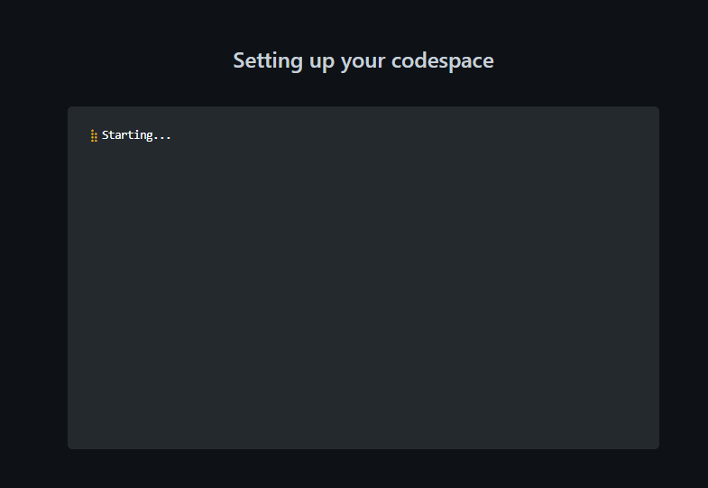
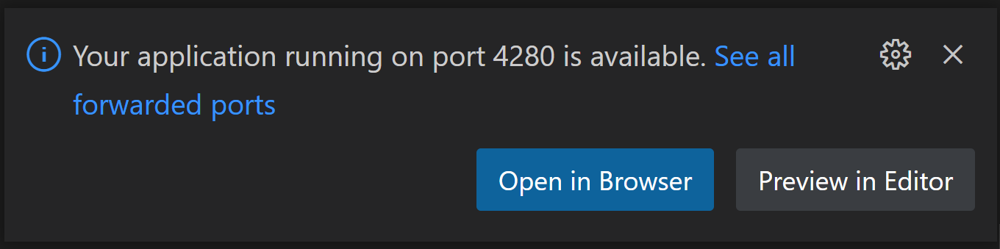
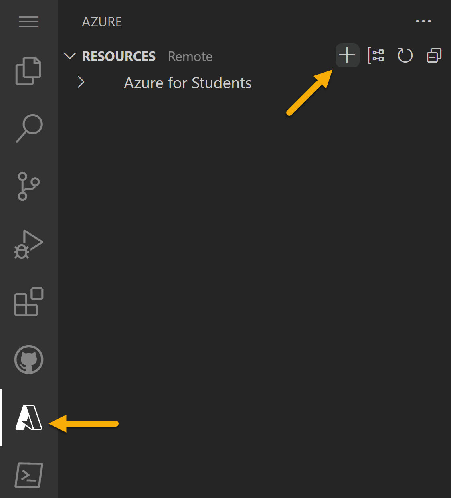
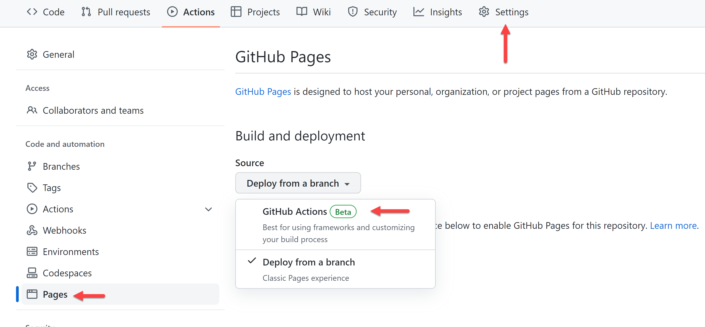
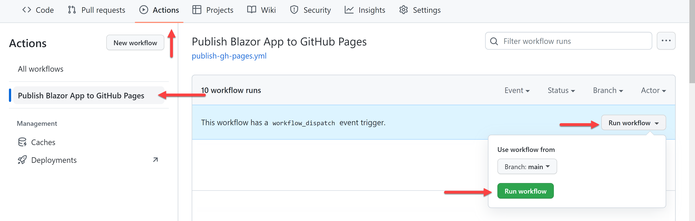
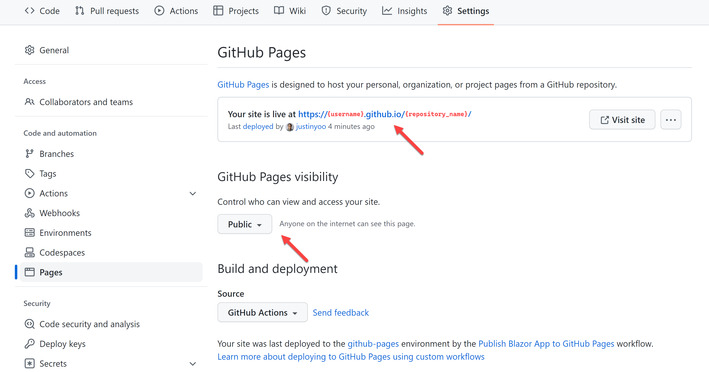
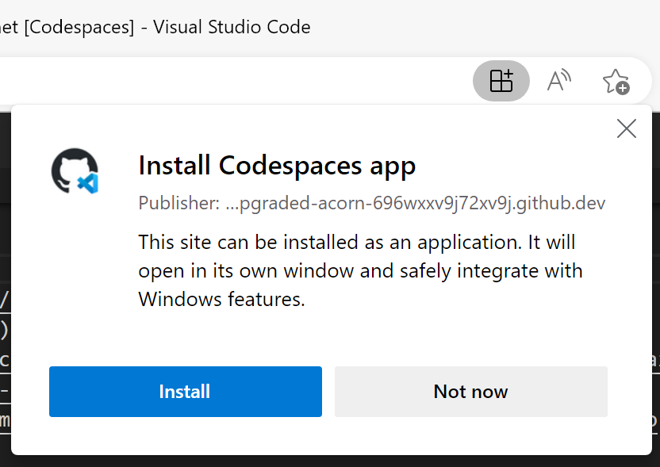

[](https://github.com/codespaces/new?hide_repo_select=true&ref=main&repo=education/codespaces-project-template-dotnet) 

# .NET (Blazor) Página de Portfólio usando GitHub Codespaces

_Crie, personalize e implante seu próprio site de portfólio em minutos._ ✨

Neste modelo de repositório temos o ambiente de desenvolvimento, e uma base de codigos prontos para uso, para que você possa iniciar imediatamente o Codespaces e personalizar sem necessidade de configuração.

* **A quem se destina?** __Todos__ que tenham interesse em criar um site de portfólio, aprender desenvolvimento web ou testar o Codespaces.
* **De quanta experiência você precisa?** __Zero__. Você decide o quanto deseja personalizar com base em sua experiência e tempo disponível.
* **Ferramentas necessárias:** _Nenhuma_. Não precisa instalar nada! Tudo o que você precisa é de um navegador da web.
* **Prerequisitos:** _Nenhum_. Este modelo inclui seu ambiente de desenvolvimento e aplicativo Web implantável para você criar seu próprio site.

## Sobre este modelo de portfólio

Nestes modelos de portfólio "escolha sua própria aventura", temos um Aplicativo Web baseado em [Blazor](https://dotnet.microsoft.com/apps/aspnet/web-apps/blazor?WT.mc_id=dotnet-82024-juyoo) pronto para você personalizar e implantar(publicar) facilmente usando apenas seu navegador da Web.


### Primeiros passos

1. Clique no botão **Use esse Template**
   
   [](https://github.com/education/codespaces-project-template-dotnet/generate)
2. Selecione o proprietário do repositório (exemplo: sua conta do GitHub)
3. Defina um nome para o repositório
4. Clique no botão **Code**
5. Clique no botão **Create Codespace on main**
6. [Personalize seu site de portfólio](#-personalize-seu-site-em-4-passos)
7. [Publique seu site](#-publique-seu-aplicativo-web)

<details>
   <summary><b>🎥 Para saber mais sobre o Codespaces, assista à nossa série de tutoriais em vídeo</b></summary>
   
   [](https://aka.ms/CodespacesVideoTutorial "Codespaces Tutorial")
</details>

<br />

## 🗃️ .NET (Blazor) Template de portfólio

Esse repositório é um modelo do GitHub para criar um site para portfólio pessoal, usando o framework Blazor WebAssembly. O objetivo é entregar um modelo para que você possa utilizar imediatamente para criar seu próprio site através do Codespaces.

O repositório contém o seguinte:

* `/.devcontainer`
  - `.devcontainer/Dockerfile`: Arquivo de configuração usado pelo Codespaces para determinar o sistema operacional e outros detalhes.
  - `.devcontainer/devcontainer.json`: Arquivo de configuração usado pelo Codespaces para definir as configurações do Visual Studio Code, como a habilitação de extensões adicionais.
  - `.devcontainer/post-create.sh`: Arquivo de configuração usado pelo Codespaces para instalar ferramentas adicionais, como o PowerShell.
* `/src`: Projeto Blazor WebAssembly para construir seu site de portfólio.
* `.editorconfig`: Configurações do [EditorConfig](https://editorconfig.org/) que ajuda a manter um padrão de codificação consistentes no Codespaces, padronizando formato de indentação, entre outros.
* `global.json`: Configurações para o aplicativo Blazor WebAssembly para evitar o uso da versão.NET pré-lançada.
* `swa-cli.config.json`: Configurações do [Azure SWA CLI](https://azure.github.io/static-web-apps-cli/) para executar o aplicativo Blazor WebAssembly em seus Codespaces.
* `MyPortfolio.sln`: O arquivo de solução que contém o projeto de aplicativo Blazor WebAssembly.

<br />

## 🚀 Começando seu projeto

Este projeto de site de portfólio é criado com dados de exemplo para que você possa abrir imediatamente o Codespaces, vê-lo em execução e fazer a implantação(publicação) a qualquer momento.

Seu ambiente de desenvolvimento está pronto para uso. Com base em nossos [Modelos de Codespaces .NET](https://github.com/education/codespaces-teaching-template-dotnet), já temos as seguintes configurações:

* Aplicação simples de [Blazor WebAssembly](https://dotnet.microsoft.com/apps/aspnet/web-apps/blazor?WT.mc_id=dotnet-82024-juyoo) com componentes para cada seção do site de portfólio
* [SWA CLI](https://azure.github.io/static-web-apps-cli/) no local para criar seu site ao implantar(publicar) no Azure
* Formatação e alinhamento de código usando [EditorConfig](https://editorconfig.org/) para consistência de código.

### Crie seu portfólio

1. Crie um repositório a partir deste modelo. Use isso [link do repo](https://github.com/education/codespaces-teaching-template-dotnet/generate). Selecione o proprietário do repositório, defina um nome, descrição e, se desejar a visibilidade do repositório para público ou privado.
2. Navegue até a página principal do repositório recém-criado. 
3. Sob o nome do repositório, use o menu suspenso Code e, na guia Codespaces, selecione "Create codespace on main" (Criar espaço de código na main).

    
    
4. Aguarde enquanto o GitHub inicializa o Codespaces.

    
    
5. Quando estiver concluído, você verá seu Codespace carregado com uma seção de terminal na parte inferior. Aqui você vai ver `dotnet restore && dotnet build` em execução. Quando concluído, você retornará ao prompt do terminal, onde poderá executar o aplicativo Web executando o comando: `swa start`.

   Quando o aplicativo Web for iniciado, você verá um prompt informando que ele foi iniciado com êxito na porta 4280 e poderá abrir esse site em seu navegador:

   

<br />

## ✨ Personalize seu site em 4 passos

Este projeto foi construído para ser facilmente personalizável. Cada seção do site é um componente separado e suas informações precisam ser definidas em apenas um local. Isso não é apenas para facilitar a atualização, mas para que você possa ver como os valores de props são passados para os componentes do React.

Para cada etapa, abra o projeto no Codespaces, faça suas alterações enquanto estiver dentro do Codespaces.

> Veja [Usando o controle do código-fonte em seu Codespaces](https://docs.github.com/codespaces/developing-in-codespaces/using-source-control-in-your-codespace) para obter mais instruções de controle de código-fonte do Codespaces

### 1️⃣ Adicione suas informações e contas de mídia social

Abra `/src/RapsLepeli/wwwroot/sample-data/siteproperties.json`. Este é um objeto JSON que armazena os pares de chave-valor necessários para personalizar seu nome, título, email e contas de mídia social.

```jsonc
{
  "name": "Alexandrie Grenier",
  "title": "Web Designer & Content Creator",
  "email": "alex@example.com",
  "gitHub": "microsoft",
  "devDotTo": null,
  "instagram": "microsoft",
  "linkedIn": "satyanadella",
  "medium": "",
  "twitter": "microsoft",
  "youTube": "microsoft",
};
```

Atualize para o nome e o título que você deseja exibir na parte superior do seu site.

_Valores opcionais_ são endereço de e-mail e contas sociais. Eles são usados no componente `Footer`(Rodapé). Se qualquer item não estiver incluído na lista ou definido como uma string vazia (""), não será exibido o ícone e o link.

### 2️⃣ Atualizando imagens

Este site de portfólio inclui 3 imagens: fundo da seção superior, fundo "Sobre mim" e a seção de portfólio. As imagens devem ser em formato de **paisagem** e podem ser sua escolha de sua própria coleção, ou encontradas em um banco de imagens que permita usar sem atribuição.

Alguns sites possíveis para encontrar fotos são [Pixabay](https://pixabay.com/) e [Unsplash](https://unsplash.com). Fotos, ilustrações e vetores, sua escolha! Quando você encontrar suas imagens, salve cada uma delas em `/src/RapsLepeli/wwwroot/images` com um nome curto e significativo.

Abra `/src/RapsLepeli/wwwroot/sample-data/heroimages.json` e atualize as imagens com as suas preferidas, bem como o texto alternativo para cada imagem:

```jsonc
[
  {
    // Componente Home
    // na parte superior da página, imagem principal que você verá quando o site for carregado (mulher em pé ao lado da parede do servidor na amostra)
    "name": "home",
    "src": "images/server-wall.jpg",
    "alt": "woman holding laptop standing by server room with glass wall"
  },
  {
    // Componente Sobre min
    // fundo por trás da seção detalhada "sobre mim" (mosaico abstrato na amostra)
    "name": "about",
    "src": "images/mosaic.svg",
    "alt": "purple and blue abstract background"
  },
  {
    // Componente Portfolio
    // imagem realçada no lado esquerdo da seção (foto da mesa de design na amostra)
    "name": "portfolio",
    "src": "images/design-desk.jpeg",
    "alt": "desktop with books and laptop"
  }
]
```

### 3️⃣ Adicione o seu "sobre mim"

A seção "Sobre mim" ajuda as pessoas a conhecer um pouco mais sobre suas habilidades e paixões. Abra `/src/RapsLepeli/wwwroot/sample-data/aboutme.json` e atualize essas 3 propriedades:

* `description`: uma ou duas frases curtas, descrevendo a si mesmo, seus objetivos de carreira e/ou paixões
* `skillsList`: um [array](https://developer.mozilla.org/docs/Web/JavaScript/Reference/Global_Objects/Array) de suas habilidades para listar no site, pode ser quantas você desejar
* `detailOrQuote`: bloco mais longo para você adicionar mais detalhes sobre si mesmo, ou até mesmo uma citação que você gosta.


### 4️⃣ Adicionar itens nos quais você trabalhou e detalhar o texto

Esta seção que será atualizada é o portfólio, onde você destaca itens nos quais trabalhou. Seriam artigos, vídeos, design de logos, projetos do GitHub, qualquer coisa que te destaque!

Abra `/src/RapsLepeli/wwwroot/sample-data/projects.json` que é uma array (matriz) de JSON. Cada item que você deseja destacar precisa: título, descrição e URL.

O experimento de exemplo tem 4, mas o número que você inclui depende de você.

```jsonc
[
  {
    "title": "10 coisas para saber sobre os Static Web Apps do Azure 🎉",
    "description": "Colaboração para criar um artigo amigável para iniciantes para ajudar a explicar os Static Web Apps do Azure e as ferramentas para começar.",
    "url": "https://dev.to/azure/10-things-to-know-about-azure-static-web-apps-3n4i"
  },
  {
    "title": "Desenvolvimento Web para Iniciantes",
    "description": "Contribuiu com imagens de notas de esboço para acompanhar cada lição. Estes ajudam a fornecer representação visual do que está sendo ensinado.",
    "url": "https://github.com/microsoft/web-dev-for-beginners"
  },
  {
    "title": "Meu Site de Currículo",
    "description": "Criado a partir do workshop de currículo da Microsoft e implantado em GitHub Pages. Inclui minha experiência e habilidades de design.",
    "url": "https://github.com/microsoft/workshop-library/tree/main/full/build-resume-website"
  },
  {
    "title": "GitHub Codespaces e github.dev",
    "description": "Entrevista em vídeo para explicar quando usar GitHub.dev versus GitHub Codespaces e qual a melhor forma de usar cada ferramenta.",
    "url": "https://www.youtube.com/watch?v=c3hHhRME_XI"
  }
]
```

<br/>

## 🏃 Publique seu aplicativo Web

O projeto inclui a configuração necessária para você publicar gratuitamente em ambos lugares, no [Azure Static Web Apps](https://azure.microsoft.com/products/app-service/static/?WT.mc_id=dotnet-82024-juyoo) e no [GitHub Pages](https://pages.github.com/)</a>.

### Azure Static Web Apps

[Azure Static Web Apps](https://azure.microsoft.com/products/app-service/static/?WT.mc_id=dotnet-82024-juyoo) é a solução de hospedagem da Microsoft para sites estáticos (ou sites que são renderizados no navegador do usuário, não em um servidor) no Azure. Esse serviço oferece oportunidades adicionais para expandir seu site atrávez de Azure Functions, autenticação, versões de staging(ambientes pré-produção / pré-publicação) e muito mais.

Você precisará de contas do Azure e do GitHub para implantar seu aplicativo Web. Se você ainda não tiver uma conta do Azure, poderá criá-la de dentro durante o processo de implantação ou nos links abaixo:

* [Criar uma conta no Azure For Students (Não é necessário ter cartão de crédito)](https://azure.microsoft.com/free/students/?WT.mc_id=dotnet-82024-juyoo)
* [Criar uma nova conta de teste Azure (requer cartão de crédito)](https://azure.microsoft.com/free/?WT.mc_id=dotnet-82024-juyoo)

Com seu projeto aberto no Codespaces:

1. Clique no ícone do Azure na barra lateral esquerda. Faça login se ainda não estiver, e se for novo no Azure, siga as instruções para criar sua conta.
2. No menu do Azure, clique no simbolo "➕" e, em seguida, escolha "Create Static Web App" (Criar Aplicativo Web Estático).

   

3. Se você não estiver logado no GitHub, será solicitado que você faça login. Se você tiver alguma alteração de arquivo pendente, será solicitado que você faça o commit dessas alterações.
4. Defina as informações do aplicativo quando solicitado:
    1. **Name for Static Web App**: insira o nome do Aplicativo Web Estático. Padrão para o nome do repositório do GitHub.
    2. **Region**: escolha o mais próximo da sua região
    3. **Project structure**: selecione "Blazor"
    4. **Location of application code**: entre `/src/RapsLepeli`
    5. **Output location**: entre `wwwroot`
5. Quando concluído, você verá uma notificação na parte inferior da tela e um novo fluxo de trabalho do GitHub Actions será adicionado ao seu projeto. Se você clicar em "Abrir Github Actions", verá a ação que foi criada para você e está em execução no momento.

> 🤩 **Bônus**: [Configurar um domínio personalizado para o seu Azure Static Web App](https://learn.microsoft.com/shows/azure-tips-and-tricks-static-web-apps/how-to-set-up-a-custom-domain-name-in-azure-static-web-apps-10-of-16--azure-tips-and-tricks-static-w/?WT.mc_id=dotnet-82024-juyoo)

### GitHub Pages

[GitHub Pages](https://pages.github.com/) permite que você hospede sites diretamente do seu repositório GitHub. Este projeto já está configurado para você publicar seu portfólio em páginas do GitHub em poucos passos.

No repositório do GitHub:

1. Vá para a guia "Settings" e navegue até o menu "Pages".
2. Sob _Build and deployment_ selecione a origem para **GitHub Actions**.

    

3. Garanta a visibilidade de sua Página do GitHub para o **Publico**.
4. Execute um fluxo de trabalho do Github Actions enviando o código por push ou adicionando manualmente.

    

5. Visite sua pagina no GitHub Pages.

    

> 🤩 **Bônus**: [Configurar um dominio poersonalizado para seu site no GitHub pages](https://docs.github.com/pages/configuring-a-custom-domain-for-your-github-pages-site/managing-a-custom-domain-for-your-github-pages-site)

<br />

## 🏆 Desafios

Abaixo estão 4 maneiras adicionais que você pode continuar a personalizar seu site de portfólio e aprender mains sobre Codespaces, CSS, HTML e JavaScript ao longo do caminho.

  1. [Personalizar seu Codespaces](#1-personalizar-seu-codespaces)
  2. [Atualizar a rolagem suave para uma seção](#2-atualizar-a-rolagem-suave-para-uma-seção)
  3. [Animar a foto da backgroud](#3-animar-a-foto-da-backgroud)
  4. [Adicionar uma nova seção](#4-adicionar-uma-nova-seção)

### 1. Personalizar seu Codespaces

Seu ambiente vem com extensões pré-instaladas. Você pode alterar com quais extensões seu ambiente Codespaces começa, veja como:

1. Abra o arquivo _.devcontainer/devcontainer.json_ e localize o seguinte elemento JSON **extensions**

   ```jsonc
   "extensions": [
     "ms-dotnettools.csharp",
     "ms-vscode.PowerShell",
     "ms-vscode.vscode-node-azure-pack",
     "VisualStudioExptTeam.vscodeintellicode"
   ]
   ```

2. Vamos adicionar a extenção `indent-rainbow`. Para fazer isso, vá para a lista de **extensions** e adicione-o:

   ```jsonc
   "oderwat.indent-rainbow"
   ```
  
   O que você fez acima foi adicionar o identificador exclusivo de uma extensão do [indent-rainbow](https://marketplace.visualstudio.com/items?itemName=oderwat.indent-rainbow&WT.mc_id=dotnet-82024-juyoo). Isso permitirá que o Codespaces saiba que essa extensão deve ser pré-instalada na inicialização.

Como localizar o identificador exclusivo de uma extensão:

* Navegue até a página da Web da extensão, como [https://marketplace.visualstudio.com/items?itemName=oderwat.indent-rainbow](https://marketplace.visualstudio.com/items?itemName=oderwat.indent-rainbow&WT.mc_id=dotnet-82024-juyoo)
* Localize o campo _Unique Identifier_ sob a seção **More info** no lado direito.
   
> 💡 Learn more here, <https://docs.github.com/codespaces/customizing-your-codespace/personalizing-github-codespaces-for-your-account>

### 2. Atualizar a rolagem suave para uma seção

No cabeçalho do seu site, você tem links para cada seção abaixo. Clique em um desses links e veja a rolagem da página até essa seção. Não é realmente uma rolagem, certo?

Vamos tornar isso uma experiência de usuário melhor, diminuindo a velocidade para que o usuário tenha uma noção do que está acontecendo e para onde está navegando na página.

1. Abra `/src/RapsLepeli/wwwroot/css/app.css`, que é a folha de estilo para seu aplicativo de portfólio. Precisamos adicionar um estilo para o `html`. Se você olhar, você vai ver agora o `html` e o `body` com os estilos estão sendo definidos juntos, então vamos adicionar o seguinte trecho CSS para definir a rolagem para o elemento `html`:

    ```css
    html {
      scroll-behavior: smooth;
    }
    ```

Seu site já deve estar em execução em seu Codespaces e a alteração será recarregada na página automaticamente. Clique em um link no cabeçalho superior para ver a rolagem suave em ação.

### 3. Animar a foto da backgroud

As animações são uma maneira de adicionar facilmente algum movimento aos elementos da sua página para aumentar a interatividade do usuário e destacar itens que você deseja garantir que eles percebam. Vamos animar a foto de background na seção portfólio.

1. Abrir a folha de estilo do seu site, `/src/RapsLepeli/wwwroot/css/app.css` dentro de seu Codespaces. Adicione a sequência de animação adicionando um `@keyframes` com definição para deslizar a partir da esquerda:

    ```css
    @keyframes slideInLeft {
      0% {
        transform: translateX(-100%);
      }
      100% {
        transform: translateX(0);
      }
    }
    ```

2. Agora que definimos o nossa sequência de animação `slideInLeft`, podemos dizer à  nossa foto da mesa para animar-se com essa sequência. Abrir `/src/RapsLepeli/Components/Portfolio.razor` e localize a tag `img`. Você verá que ele utiliza CSS embutido para definir seu estilo. Dentro de sua definição de estilo, adicione o seguinte:

    ```css
    animation: 1s ease-out 0s 1 slideInLeft;
    ```

    Sua tag de imagem deve ter a seguinte aparência:

    ```html
    
    ```

Seu site já deve estar em execução em seu Codespaces e a alteração será recarregada na página automaticamente. Role a página para cima e para baixo e veja sua foto de mesa deslizar para a página.

> 🤩 **Bônus**: Animar seta de rolagem para baixo

### 4. Adicionar uma nova seção

Começamos com algumas seções básicas para o seu site de portfólio, mas você tem liberdade criativa para torná-lo seu e adicionar novas seções relevantes para o que você deseja em seu site.

Por exemplo, vamos adicionar uma seção de educação ao seu site de portfólio.

1. Crie um novo componente para a seção dentro da pasta `Components`. Adicione um novo arquivo com nome de `Education.razor`.

2. Em `Education.razor` adicione a função do componente, a exportação e as informações que você gostaria de incluir:

    ```razor
    <section class="light" id="portfolio">
        <h2>Education</h2>
    </section>
    ```

3. No arquivo `Index.razor` adicione o componente `Education` onde você gostaria que ele fosse renderizado dentro da página, inserindo:

    ```razor
    <Education />
    ```

Em seu Codespaces, seu aplicativo de portfólio deve estar em execução e recarregará seu site com as alterações.


<br />

## 📚 Recursos

* [GitHub Codespaces docs visão geral](https://docs.github.com/codespaces/overview)
* [GitHub Codespaces guias](https://docs.github.com/codespaces/guides)
* [Use contêineres de desenvolvimento localmente com VS Code and Docker](https://github.com/microsoft/vscode-remote-try-dotnet#vs-code-dev-containers)
* [Iniciando com Blazor](https://learn.microsoft.com/training/paths/build-web-apps-with-blazor/?WT.mc_id=dotnet-82024-juyoo)
* [Desenvolvimento web para Iniciantes](https://github.com/microsoft/Web-Dev-For-Beginners)

> #### Aplicativo Codespaces
>
> Se você estiver usando o Edge ou o Chrome, verá uma opção para instalar o aplicativo Codespaces ao iniciar o Codespaces. O aplicativo Codespaces permite que você inicie seus Codespaces dentro do aplicativo para que você possa trabalhar fora do navegador. Procure o ícone do aplicativo e instale o pop-up para experimentá-lo.
>
> 

<br />

## 🔎 Encontrou um problema ou tem uma ideia de melhoria?

Ajude-nos a melhorar este repositório de modelos [nos diga como melhorar, e abra um PR!](https://github.com/education/codespaces-project-template-dotnet/issues/new).